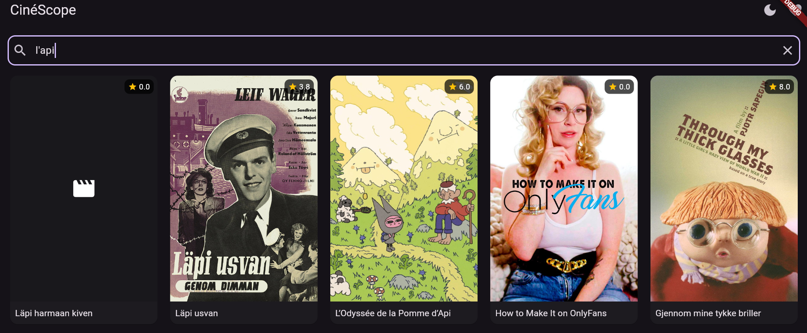
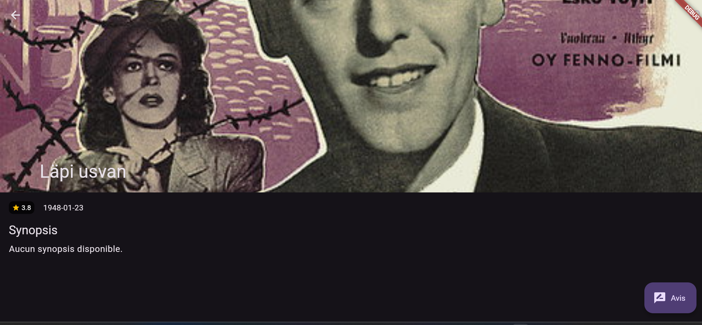
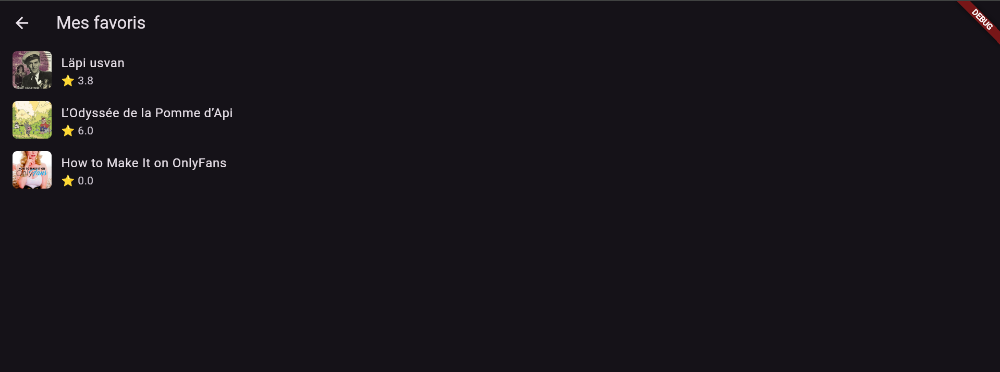
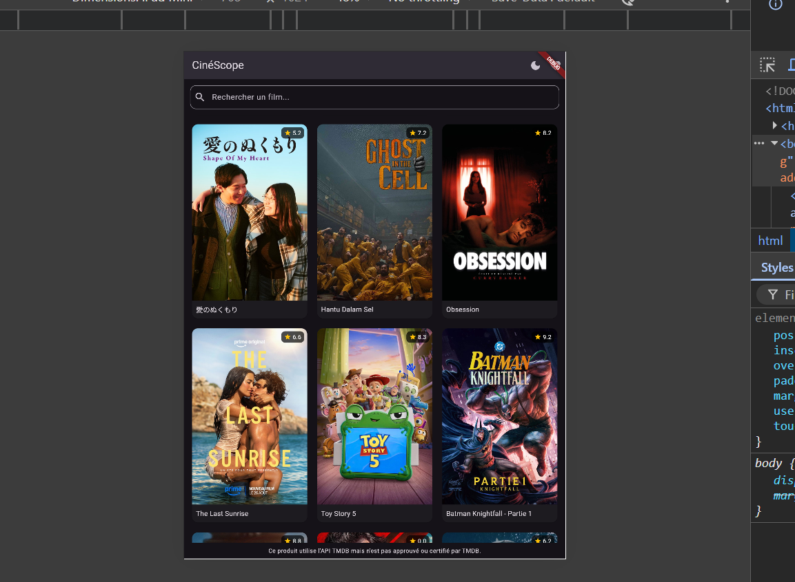

# 🎬 CinéScope

Application Flutter multi-écrans de découverte de films, construite dans le cadre d'un projet de certification en navigation et widgets Flutter.

CinéScope permet de parcourir les films populaires, de les rechercher, de consulter leurs détails, de les ajouter en favoris et de laisser un avis — le tout avec un thème clair/sombre et une interface adaptative (mobile/tablette).

---

## ✨ Fonctionnalités

- 🎥 **Liste de films populaires** avec recherche en temps réel (debounce)
- 📄 **Écran de détail** avec synopsis, note, date de sortie et affiche
- ⭐ **Favoris** persistants pendant la session, gérés via `Provider`
- 📝 **Formulaire d'avis** avec validation (nom, note, commentaire)
- 🌗 **Thème clair / sombre** basculable depuis l'écran d'accueil
- 📱💻 **Interface responsive** : grille adaptative (2 colonnes mobile → 5 colonnes desktop)
- 🔗 **Navigation par URL** avec GoRouter (paramètres de route, deep linking-ready)

---

## 📸 Captures d'écran

| Accueil (clair)                             | Accueil (sombre)                          |
| ------------------------------------------- | ----------------------------------------- |
|  |  |

| Recherche                            | Détail                             |
| ------------------------------------ | ---------------------------------- |
|  |  |

| Favoris                             | Formulaire d'avis                      |
| ----------------------------------- | -------------------------------------- |
|  |  |

| Vue tablette / large écran            |
| ------------------------------------- |
|  |

---

## 🛠️ Stack technique

| Domaine                   | Technologie                                                           |
| ------------------------- | --------------------------------------------------------------------- |
| Framework                 | Flutter                                                               |
| Navigation                | [go_router](https://pub.dev/packages/go_router)                       |
| Gestion d'état            | [provider](https://pub.dev/packages/provider)                         |
| Appels API                | [http](https://pub.dev/packages/http)                                 |
| Variables d'environnement | [flutter_dotenv](https://pub.dev/packages/flutter_dotenv)             |
| Cache d'images            | [cached_network_image](https://pub.dev/packages/cached_network_image) |
| Source de données         | [TMDB API](https://www.themoviedb.org/documentation/api)              |

---

## 📂 Structure du projet

```
lib/
├── main.dart                  # Point d'entrée, providers, thème
├── models/
│   └── movie.dart              # Modèle de données Movie
├── services/
│   ├── movie_api_service.dart  # Appels API TMDB (popular, search, detail)
│   └── favorites_notifier.dart # Gestion d'état des favoris
├── theme/
│   ├── app_theme.dart          # Thèmes clair/sombre
│   └── theme_notifier.dart     # Gestion d'état du thème
├── router/
│   └── app_router.dart         # Configuration GoRouter
├── screens/
│   ├── home_screen.dart        # Liste, recherche, responsive
│   ├── detail_screen.dart      # Détail d'un film
│   ├── favorites_screen.dart   # Liste des favoris
│   └── add_review_screen.dart  # Formulaire d'avis
└── widgets/
    ├── movie_card.dart         # Carte film réutilisable
    ├── rating_badge.dart       # Badge de note réutilisable
    └── empty_state.dart        # État vide réutilisable
```

---

## 🚀 Installation et lancement

### 1. Prérequis

- [Flutter SDK](https://docs.flutter.dev/get-started/install) installé
- Une clé API TMDB (gratuite) — [créer un compte et obtenir une clé](https://www.themoviedb.org/settings/api)

### 2. Cloner le repo

```bash
git clone https://github.com/<ton-username>/cinescope.git
cd cinescope
```

### 3. Installer les dépendances

```bash
flutter pub get
```

### 4. Configurer la clé API

Crée un fichier `.env` à la racine du projet :

```
TMDB_API_KEY=ta_cle_api_ici
```

> ⚠️ Ce fichier n'est **pas** versionné (voir `.gitignore`) — chaque utilisateur doit fournir sa propre clé.

### 5. Lancer l'application

```bash
flutter run
```

Pour lancer sur le web :

```bash
flutter run -d chrome
```

---

## 📝 Notes

- Ce produit utilise l'API TMDB mais n'est pas approuvé ou certifié par TMDB.
- Projet réalisé à des fins éducatives dans le cadre d'une certification Flutter.

---

## 👤 Auteur

**Honodev** (Christ-David Djeke)
